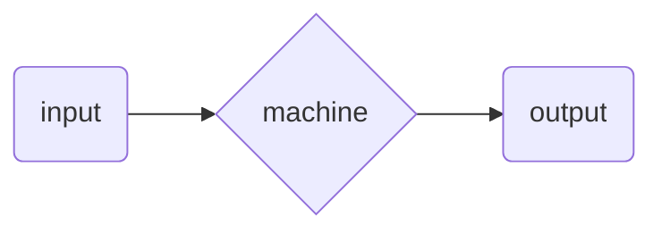
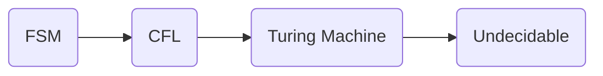

# Base of Computing

## What is the theory of computing ?

> The root behind computer science becoming computer science.

The main thing is determining if any machine, code, program, data etc. can count or compute any thing. if it can count than what is the boundary of the count. All the theoretical discussions about count and compute by machines is called `Theory of Computing`

## Saying of Alan Turing Change Everything

Alan Turing Said,

> There can be a machine that can solve any and every problem available on computation or mathematics.

`On this statement computer science born`

# `Recognizing` Computational Problem

A problem is a computational problem if it can be solvable by any sort of mathematical `counting`, `operation handling` , `comparing` or `reducing`.

### Counting

By taking count of any thing available like,

-   array element
-   object
-   rotation count of a helicopter rotor
-   etc.

### Operation Handling

performing

1.  addition
2.  subtraction
3.  multiplication
4.  division
5.  etc. operations

### Comparing

Performing

1.  and, or, not
2.  NAND, NOR
3.  XOR, XNOR
4.  etc. on any expression or machine

### Reducing

Reducing dynamic steps for computation.

# `Handling` Computational Problem

> Once A problem is recognized as computational problem we have to ask 3 questions …

1.  Is the computer able to solve the problem ? `ability`
2.  How efficiently it can be solved ? `efficiency`
3.  How do we know that the solution is correct ? `accuracy`

So the 3 steps to handle a computational problem is

-   Ability
-   Efficiency
-   Accuracy

# Bisecting Theory of Computing

> Let’s make the Phrase divided in 3 words

> `Theory` `of` `Computing`

now excluding the meaningless preposition we get 2 words

> `Theory` `Computing`

## Theory

> Theory talks about the machine itself.

-   Capabilities
-   Complexities
-   Limitations

All the machines that can compute have to have these things known. Without this theory part of knowing these 3 the machine can produce inaccurate information which may lead to bigger problems.

## Computing

> This part talks about the ability of the machine to solve the problem.

Like no machine can take responsibility to count all the atoms correctly in the universe. this is just not possible by any counting machine. So till this date there is no computing machine that can do so.

# An example Computation Problem

> Having a Binary string, `S = 1101010` Determine if the last digit of this string is a `“0”`

## Introducing it to machine



## Steps `Capability`

> If we can determine steps that means Machine has capability to solve the problem

1.  Check from beginning of the string
2.  stop at the end of the string
3.  test if that is `0` or not.
4.  if yes ⇒ return true
5.  if No ⇒ return false

## Finding better way to solve `Complexity`

> Find if there is any better way to solve the problem

Like if we start from the end of the string we can get the solution in one look and there is no need to iterate over the string.

This reduces `complexity`

## Constrains for solving `Limitation`

> For this problem there is no constrain in use that can hold modern computers out of solving this problem. But there are some fore same type of problems

— if the string size is larger than available memory space on a machine then `size of the string`  
can be a constrain of this problem

# Parts of `Theory of Computing`

> Theory of Computing is divided into 3 parts

-   Automata Theory
-   Compatibility Theory
-   Complexity Theory

# Automata Theory

> Automata = “self-acting”

> Automation = an abstract model for automating any machine

→ Alan Turing first thought about automatic machines. Machines that can solve problem by itself

## Levels of Automata theory

-   Finite State Automata (FSM)
-   Context Free Language
-   Push Down Automata
-   Turing Machine

## Layer Diagram for Automata Theory




FSM ⇒ Finite State Automata → Easiest theory of computing

CFL ⇒ Context Free Language + Pushdown Automata → Can do more than FSM

TM ⇒ Turing Machine → Turing Machine can solve problems as hard as todays computers solve

### Complexity of Automata

$$ \text{FSM < CFL < TM} $$

```
                          worst <———————————————> best

```

## Finite State Automata

> FSM is capable for,

-   Checking the behavior of digital circuits
-   Doing `Lexical Analysis` for building compilers
-   Software for scanning large body of text
-   Testing things that has finite states
